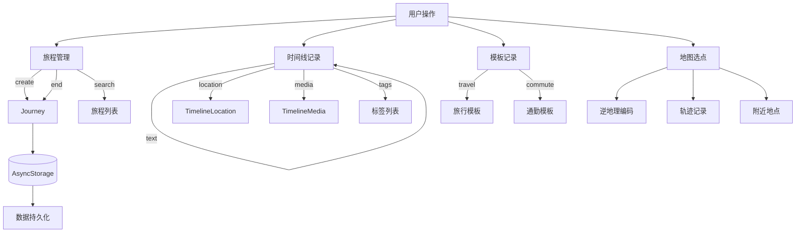

# 数据模型

本文档描述 GoWherer 应用的核心数据类型定义，源码位于 `types/` 目录。

## 枚举类型

### JourneyKind

旅程类型，区分旅行与通勤两种模式。

```typescript
export type JourneyKind = 'travel' | 'commute';
```

| 值 | 说明 |
|----|------|
| `travel` | 旅行 |
| `commute` | 通勤 |

### JourneyStatus

旅程状态，标识旅程是否正在进行。

```typescript
export type JourneyStatus = 'active' | 'completed';
```

| 值 | 说明 |
|----|------|
| `active` | 进行中 |
| `completed` | 已结束 |

### MediaType

媒体附件类型。

```typescript
export type MediaType = 'photo' | 'video' | 'audio';
```

| 值 | 说明 |
|----|------|
| `photo` | 照片 |
| `video` | 视频 |
| `audio` | 音频 |

### CoordinateType

坐标系类型，用于区分 WGS84 和 GCJ02。

```typescript
export type CoordinateType = 'wgs84' | 'gcj02';
```

| 值 | 说明 |
|----|------|
| `wgs84` | 国际标准坐标系（GPS 使用） |
| `gcj02` | 中国国测局坐标系（高德、腾讯使用） |

### ReverseGeocodeProvider

反向地理编码服务提供商。

```typescript
export type ReverseGeocodeProvider = 'system' | 'amap';
```

| 值 | 说明 |
|----|------|
| `system` | 系统原生地理编码 |
| `amap` | 高德地图 Web API |

---

## 核心类型

### TimelineLocation

时间线中的位置数据。

```typescript
export type TimelineLocation = {
  latitude: number;          // 纬度 (-90 ~ 90)
  longitude: number;         // 经度 (-180 ~ 180)
  accuracy?: number | null;  // 定位精度（米），可选
  placeName?: string;         // 地点名称（通过逆地理编码获取），可选
};
```

### TimelineMedia

时间线中的媒体附件。

```typescript
export type TimelineMedia = {
  id: string;                // 唯一标识符（UUID）
  type: MediaType;            // 媒体类型：photo | video | audio
  uri: string;               // 媒体资源 URI（本地路径或网络 URL）
  thumbnailUri?: string;      // 视频缩略图 URI，可选
};
```

### TimelineEntry

时间线条目，即旅程中的一条记录。

```typescript
export type TimelineEntry = {
  id: string;                // 唯一标识符（UUID）
  createdAt: string;         // 创建时间，ISO 8601 格式字符串
  text: string;               // 文本内容
  location?: TimelineLocation; // 关联的位置信息，可选
  media: TimelineMedia[];     // 媒体附件列表
  tags: string[];             // 标签列表
};
```

### Journey

旅程主体，包含一次完整出行的所有信息。

```typescript
export type Journey = {
  id: string;                // 唯一标识符（UUID）
  title: string;             // 旅程标题
  kind: JourneyKind;          // 旅程类型：travel | commute
  createdAt: string;          // 创建时间，ISO 8601 格式
  endedAt?: string;           // 结束时间，ISO 8601 格式，可选
  status: JourneyStatus;      // 旅程状态：active | completed
  tags: string[];             // 旅程级标签
  entries: TimelineEntry[];   // 时间线条目列表
  trackLocations: TimelineLocation[]; // 持续 GPS 轨迹点集合
};
```

### EntryTemplate

记录模板，用于快速录入预设文本与标签。

```typescript
export type EntryTemplate = {
  id: string;                // 唯一标识符
  label: string;              // 显示标签（中文）
  text: string;               // 模板预置文本内容
  tags: string[];             // 预置标签列表
};
```

### EntryTemplateConfig

按旅程类型分类的模板配置。

```typescript
export type EntryTemplateConfig = Record<JourneyKind, EntryTemplate[]>;
```

### NearbyPlace

附近地点查询结果。

```typescript
export type NearbyPlace = {
  id: string;                // 地点唯一标识
  name: string;               // 地点名称
  address?: string;            // 详细地址，可选
  distance?: number;           // 距查询点的距离（米），可选
  latitude: number;            // 纬度
  longitude: number;           // 经度
};
```

### LocalePreference

语言偏好设置。

```typescript
export type LocalePreference = Locale | 'system';
export type Locale = 'en' | 'zh';
```

---

## 数据流向



---

## 存储键

所有数据通过 AsyncStorage 本地持久化，存储键前缀为 `gowherer:`。

| 存储键 | 数据类型 | 说明 |
|--------|----------|------|
| `gowherer:journeys:v1` | `Journey[]` | 所有旅程数据 |
| `gowherer:entry-templates:v1` | `EntryTemplateConfig` | 模板配置 |
| `gowherer:entry-templates:v1:zh` | `EntryTemplate[]` | 中文模板 |
| `gowherer:entry-templates:v1:en` | `EntryTemplate[]` | 英文模板 |
| `gowherer:pending-location:v1` | `TimelineLocation` | 待处理位置（地图选点后临时存储） |