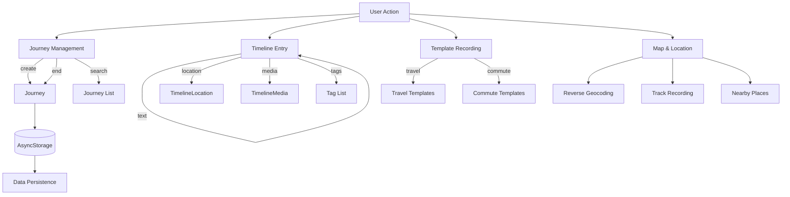

# Data Models

This document describes the core data type definitions in GoWherer. Source code is located in the `types/` directory.

## Enums

### JourneyKind

Journey type, distinguishing between travel and commute modes.

```typescript
export type JourneyKind = 'travel' | 'commute';
```

| Value | Description |
|-------|-------------|
| `travel` | Travel |
| `commute` | Commute |

### JourneyStatus

Journey status, indicating whether the journey is in progress.

```typescript
export type JourneyStatus = 'active' | 'completed';
```

| Value | Description |
|-------|-------------|
| `active` | In progress |
| `completed` | Completed |

### MediaType

Media attachment type.

```typescript
export type MediaType = 'photo' | 'video' | 'audio';
```

| Value | Description |
|-------|-------------|
| `photo` | Photo |
| `video` | Video |
| `audio` | Audio |

### CoordinateType

Coordinate system type, used to distinguish WGS84 and GCJ02.

```typescript
export type CoordinateType = 'wgs84' | 'gcj02';
```

| Value | Description |
|-------|-------------|
| `wgs84` | World Geodetic System 1984 (used by GPS) |
| `gcj02` | China Geodetic Coordinate System 2000 (used by Amap, Tencent) |

### ReverseGeocodeProvider

Reverse geocoding service provider.

```typescript
export type ReverseGeocodeProvider = 'system' | 'amap';
```

| Value | Description |
|-------|-------------|
| `system` | System native geocoding |
| `amap` | Amap Web API |

---

## Core Types

### TimelineLocation

Location data in a timeline entry.

```typescript
export type TimelineLocation = {
  latitude: number;          // Latitude (-90 ~ 90)
  longitude: number;          // Longitude (-180 ~ 180)
  accuracy?: number | null;  // Accuracy in meters, optional
  placeName?: string;          // Place name (via reverse geocoding), optional
};
```

### TimelineMedia

Media attachment in a timeline entry.

```typescript
export type TimelineMedia = {
  id: string;                // Unique identifier (UUID)
  type: MediaType;            // Media type: photo | video | audio
  uri: string;               // Media resource URI (local path or URL)
  thumbnailUri?: string;      // Video thumbnail URI, optional
};
```

### TimelineEntry

A single entry on the journey timeline.

```typescript
export type TimelineEntry = {
  id: string;                // Unique identifier (UUID)
  createdAt: string;         // Creation time, ISO 8601 string
  text: string;               // Text content
  location?: TimelineLocation; // Associated location, optional
  media: TimelineMedia[];    // Media attachments list
  tags: string[];             // Tags list
};
```

### Journey

The journey entity, containing all information for a complete trip.

```typescript
export type Journey = {
  id: string;                // Unique identifier (UUID)
  title: string;             // Journey title
  kind: JourneyKind;          // Journey type: travel | commute
  createdAt: string;          // Creation time, ISO 8601
  endedAt?: string;           // End time, ISO 8601, optional
  status: JourneyStatus;      // Journey status: active | completed
  tags: string[];             // Journey-level tags
  entries: TimelineEntry[];   // Timeline entries list
  trackLocations: TimelineLocation[]; // Continuous GPS track points
};
```

### EntryTemplate

Entry template for quick preset text and tag insertion.

```typescript
export type EntryTemplate = {
  id: string;                // Unique identifier
  label: string;              // Display label (in Chinese)
  text: string;               // Template preset text content
  tags: string[];             // Preset tags list
};
```

### EntryTemplateConfig

Template configuration grouped by journey type.

```typescript
export type EntryTemplateConfig = Record<JourneyKind, EntryTemplate[]>;
```

### NearbyPlace

Nearby place query result.

```typescript
export type NearbyPlace = {
  id: string;                // Unique place identifier
  name: string;               // Place name
  address?: string;            // Detailed address, optional
  distance?: number;           // Distance from query point (meters), optional
  latitude: number;            // Latitude
  longitude: number;           // Longitude
};
```

### LocalePreference

Language preference setting.

```typescript
export type LocalePreference = Locale | 'system';
export type Locale = 'en' | 'zh';
```

---

## Data Flow



---

## Storage Keys

All data is persisted locally via AsyncStorage with the prefix `gowherer:`.

| Storage Key | Data Type | Description |
|-------------|-----------|-------------|
| `gowherer:journeys:v1` | `Journey[]` | All journey data |
| `gowherer:entry-templates:v1` | `EntryTemplateConfig` | Template configuration |
| `gowherer:entry-templates:v1:zh` | `EntryTemplate[]` | Chinese templates |
| `gowherer:entry-templates:v1:en` | `EntryTemplate[]` | English templates |
| `gowherer:pending-location:v1` | `TimelineLocation` | Pending location (temporarily stored after map picker) |