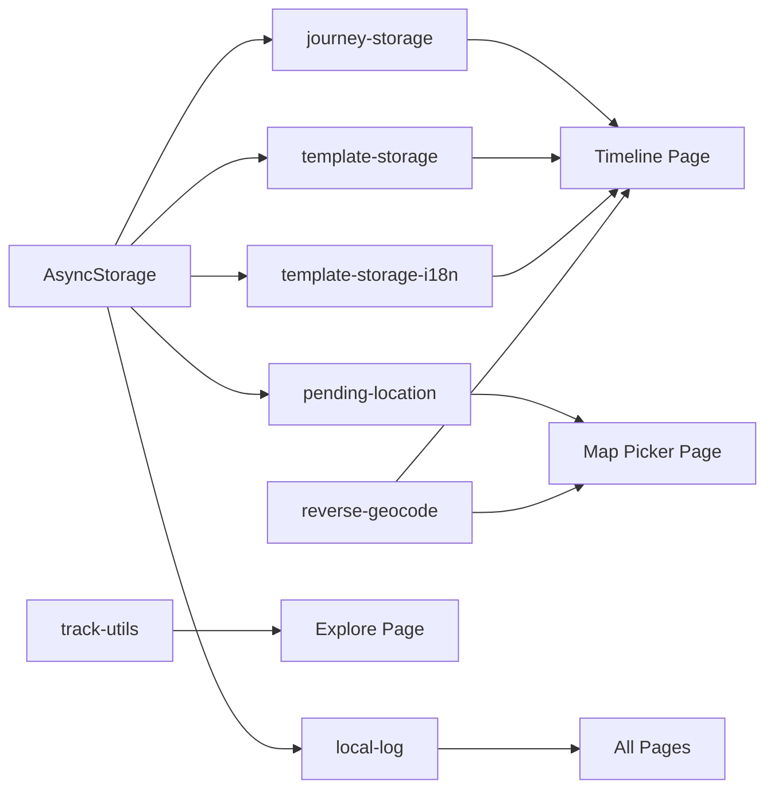

# Services

This document describes the core service modules in GoWherer. Source code is located in the `lib/` directory. All services are pure local computation or network requests with no backend API dependency.

---

## Storage Services

### Journey Storage (`lib/journey-storage.ts`)

Handles persistence of `Journey` arrays to AsyncStorage.

#### `loadJourneys()`

```typescript
async function loadJourneys(): Promise<Journey[]>
```

Loads all journey data from AsyncStorage. Returns an empty array if storage is empty or parsing fails. Automatically normalizes tags (deduplication, whitespace trimming) and media items (filters invalid entries) during load.

**Storage Key**: `gowherer:journeys:v1`

#### `saveJourneys(journeys)`

```typescript
async function saveJourneys(journeys: Journey[]): Promise<void>
```

Serializes and writes all journey data to AsyncStorage.

---

### Template Storage (`lib/template-storage.ts`)

Manages the configuration of journey entry templates.

#### `getDefaultEntryTemplateConfig()`

```typescript
function getDefaultEntryTemplateConfig(): EntryTemplateConfig
```

Returns the default template configuration, containing separate template sets for Travel and Commute modes, each with 4 built-in templates: Departure, Arrival, Rest, Checkpoint.

#### `loadEntryTemplateConfig()`

```typescript
async function loadEntryTemplateConfig(): Promise<EntryTemplateConfig>
```

Loads template configuration from AsyncStorage. Returns default configuration if storage is empty or parsing fails.

**Storage Key**: `gowherer:entry-templates:v1`

#### `saveEntryTemplateConfig(config)`

```typescript
async function saveEntryTemplateConfig(config: EntryTemplateConfig): Promise<void>
```

Serializes and writes template configuration to AsyncStorage.

---

### Template i18n Storage (`lib/template-storage-i18n.ts`)

Supports storing template configurations separately by locale.

#### `getDefaultEntryTemplateConfig(locale)`

```typescript
function getDefaultEntryTemplateConfig(locale: Locale): EntryTemplateConfig
```

Returns the default template configuration for the specified locale.

#### `loadEntryTemplateConfig(locale)`

```typescript
async function loadEntryTemplateConfig(locale: Locale): Promise<EntryTemplateConfig>
```

Loads template configuration from the locale-specific storage key.

**Storage Keys**: `gowherer:entry-templates:v1:zh` (Chinese), `gowherer:entry-templates:v1:en` (English)

#### `saveEntryTemplateConfig(locale, config)`

```typescript
async function saveEntryTemplateConfig(locale: Locale, config: EntryTemplateConfig): Promise<void>
```

Writes template configuration to the locale-specific storage key.

---

### Pending Location (`lib/pending-location.ts`)

Temporarily stores a user-selected location during the map picker flow, for later consumption.

#### `setPendingLocation(location)`

```typescript
async function setPendingLocation(location: TimelineLocation): Promise<void>
```

Stores the selected location to AsyncStorage.

**Storage Key**: `gowherer:pending-location:v1`

#### `consumePendingLocation()`

```typescript
async function consumePendingLocation(): Promise<TimelineLocation | null>
```

Reads and deletes the pending location. Returns the location data; returns `null` if none exists or parsing fails.

---

## Track Services (`lib/track-utils.ts`)

Provides GPS track point processing and statistics capabilities.

#### `sanitizeTrackLocations(locations)`

```typescript
function sanitizeTrackLocations(
  locations: Array<TimelineLocation | null | undefined>
): TimelineLocation[]
```

Filters and normalizes the track point list, removing invalid coordinates (out-of-range latitude/longitude or non-numeric values).

#### `haversineKm(a, b)`

```typescript
function haversineKm(a: TimelineLocation, b: TimelineLocation): number
```

Calculates the great-circle distance between two points using the Haversine formula (result in kilometers).

#### `smoothTrackLocations(locations)`

```typescript
function smoothTrackLocations(locations: TimelineLocation[]): TimelineLocation[]
```

Applies weighted smoothing to track points (25% weight for adjacent points, 50% for the center point). First and last points remain unchanged. Returns the original list if fewer than 3 points.

#### `calculateTrackDistanceKm(locations)`

```typescript
function calculateTrackDistanceKm(locations: TimelineLocation[]): number
```

Calculates total track distance (in kilometers). Sequentially applies the Haversine formula to accumulate distances between adjacent points.

---

## Geocoding (`lib/reverse-geocode.ts`)

Provides place name resolution and coordinate system conversion.

### Coordinate Conversion

#### `toGcj02(latitude, longitude)`

```typescript
function toGcj02(latitude: number, longitude: number): { latitude: number; longitude: number }
```

Converts WGS84 coordinates to GCJ02 (China Geodetic Coordinate System 2000) for use with Amap. Returns original values if coordinates are outside China.

#### `toWgs84(latitude, longitude)`

```typescript
function toWgs84(latitude: number, longitude: number): { latitude: number; longitude: number }
```

Converts GCJ02 coordinates back to WGS84. Returns original values if coordinates are outside China.

### Place Name Resolution

#### `reverseGeocodePlaceName(latitude, longitude, options?)`

```typescript
async function reverseGeocodePlaceName(
  latitude: number,
  longitude: number,
  options?: { coordinateType?: CoordinateType }
): Promise<string | undefined>
```

Converts coordinates to a human-readable place name. Prioritizes Amap Web API (requires `EXPO_PUBLIC_AMAP_WEB_KEY` configured). Falls back to system native geocoding if Amap call fails or the key is not configured.

| Parameter | Type | Description |
|-----------|------|-------------|
| `latitude` | `number` | Latitude |
| `longitude` | `number` | Longitude |
| `options.coordinateType` | `CoordinateType` | Input coordinate type, defaults to `wgs84` |

Returns the place name string; returns `undefined` if both methods fail.

### Nearby Places Query

#### `queryNearbyPlaces(latitude, longitude, radius?, options?)`

```typescript
async function queryNearbyPlaces(
  latitude: number,
  longitude: number,
  radius?: number,
  options?: { coordinateType?: CoordinateType }
): Promise<NearbyPlace[]>
```

Queries the list of POIs around the specified coordinates (via Amap Web API). Only works when the Amap key is properly configured; otherwise returns an empty array.

| Parameter | Type | Default | Description |
|-----------|------|---------|-------------|
| `latitude` | `number` | — | Latitude |
| `longitude` | `number` | — | Longitude |
| `radius` | `number` | `1200` | Query radius (meters), range 200-5000 |
| `options.coordinateType` | `CoordinateType` | `wgs84` | Input coordinate type |

---

## Local Logging (`lib/local-log.ts`)

In-app logging system that writes logs to a local file for error tracking and debugging.

#### `logLocalInfo(tag, message, data?)`

```typescript
async function logLocalInfo(tag: string, message: string, data?: unknown): Promise<void>
```

Logs an info-level entry. Format: `[ISO timestamp] [INFO] [tag] message | data`

#### `logLocalError(tag, error, data?)`

```typescript
async function logLocalError(tag: string, error: unknown, data?: unknown): Promise<void>
```

Logs an error-level entry. Error objects are serialized to `{ message, stack }` format.

#### `getLocalLogFileUri()`

```typescript
function getLocalLogFileUri(): string
```

Returns the log file path URI for sharing/exporting.

#### `initLocalLogFile()`

```typescript
async function initLocalLogFile(): Promise<void>
```

Initializes the log file and writes an initialization record.

**Log File Path**: `${FileSystem.documentDirectory}gowherer-debug.log`

---

## Service Dependency Graph

