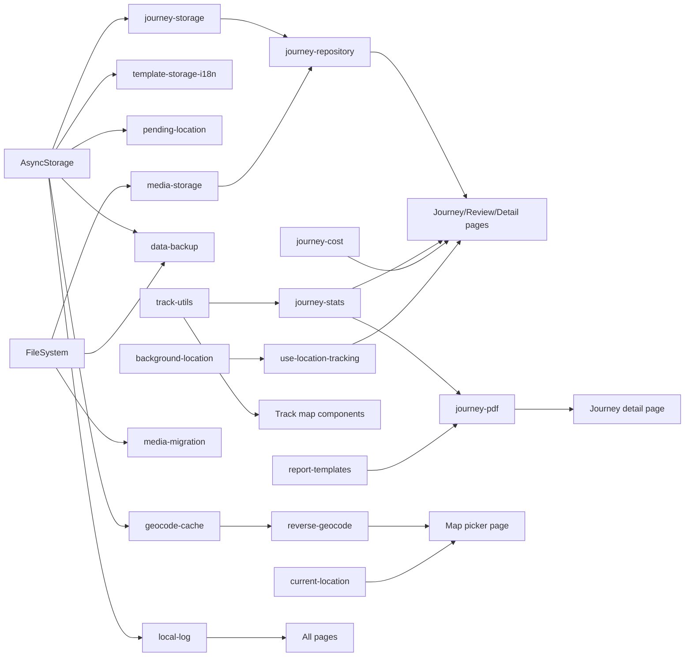

# Services

This document describes the core service modules in GoWherer. Source code is located in the `lib/` directory. All services are pure local computation or network requests with no backend API dependency.

---

## Storage Services

### Journey Storage (`lib/journey-storage.ts`)

Handles persistence of `Journey` arrays to AsyncStorage.

#### `loadJourneys()`

```typescript
async function loadJourneys(): Promise<Journey[]>
```

Loads all journey data from AsyncStorage. Returns an empty array if storage is empty or parsing fails. Automatically normalizes tags (deduplication, whitespace trimming), media items (filters invalid entries), and `trackLocations` (fills in an empty array when missing) during load.

**Storage Key**: `gowherer:journeys:v1`

#### `saveJourneys(journeys)`

```typescript
async function saveJourneys(journeys: Journey[]): Promise<void>
```

Serializes and writes all journey data to AsyncStorage.

---

### Journey Repository (`lib/journey-repository.ts`)

The unified write entry for journey data. All mutations run through an internal write queue to prevent data loss from concurrent reads/writes; after each change it diffs the before/after state and cascade-deletes media files that are no longer referenced.

#### `createJourney(title, kind, tags)`

Creates a new in-progress journey.

#### `markJourneyCompleted(journeyId)`

Ends a journey (`active` → `completed`, writes `endedAt`).

#### `insertJourneyEntry(journeyId, entry)` / `replaceJourneyEntry(journeyId, entry)` / `deleteJourneyEntry(journeyId, entryId)`

Inserts, updates, and deletes timeline entries; deleting an entry also cleans up its media files.

#### `appendJourneyTrackLocations(journeyId, locations)`

Batch-appends buffered background tracking points to the given journey.

#### `deleteJourney(journeyId)` / `overwriteJourneys(journeys)`

Deletes an entire journey (with media cascade cleanup), or overwrites the whole journey list (used by backup restore).

---

### Template Storage (`lib/template-storage.ts` / `lib/template-storage-i18n.ts`)

Manages the configuration of journey entry templates with per-locale storage.

#### `getDefaultEntryTemplateConfig(locale)`

Returns the default template configuration for the given locale, containing separate template sets for Travel and Commute modes, each with 4 built-in templates: Departure, Arrival, Rest, Checkpoint.

#### `loadEntryTemplateConfig(locale)` / `saveEntryTemplateConfig(locale, config)`

Reads/writes template configuration from/to the locale-specific storage key, falling back to defaults when parsing fails.

**Storage Keys**: `gowherer:entry-templates:v1:zh` (Chinese), `gowherer:entry-templates:v1:en` (English)

---

### Pending Location (`lib/pending-location.ts`)

Temporarily stores the location selected on the map picker for later consumption.

#### `setPendingLocation(location)` / `consumePendingLocation()`

One-shot location handoff: write, then read-and-delete. Returns `null` on read failure.

**Storage Key**: `gowherer:pending-location:v1`

---

## Statistics Service (`lib/journey-stats.ts`)

The unified outlet for trip statistics, segment statistics, and display formatting.

#### `computeJourneyStats(journey, trackLocations?)`

```typescript
function computeJourneyStats(
  journey: Journey,
  trackLocations?: TimelineLocation[]
): { locationPoints: number; distanceKm: number; durationMs: number; avgSpeedKmh: number }
```

Computes total distance (preferring GPS track, falling back to entry locations), total duration, average speed, and location point count.

#### `computeSegmentStats(journey, trackLocations, startIndex, endIndex)`

```typescript
function computeSegmentStats(
  journey: Journey,
  trackLocations: TimelineLocation[],
  startIndex: number,
  endIndex: number
): SegmentStats
```

Computes segment statistics between two record points: segment duration, segment distance (summing GPS track points whose `capturedAt` falls between the two entries, falling back to the straight-line distance), and segment average speed, plus the `segmentTrack` used for map highlighting.

#### `getSegmentStats(journey, trackLocations, journeyId, startIndex, endIndex)`

Cached wrapper (keyed by `journeyId:start:end`) that avoids recomputing thousands of track points on every dropdown toggle.

#### Formatting Utilities

- `formatDateTime(iso?)`: `MM/dd HH:mm` display.
- `formatDuration(durationMs, t)`: localized duration text.
- `formatLocationLabel(location)`: place name + coordinates.
- `kindLabel(kind, t)`: journey kind text.
- `getJourneyTrackLocations(journey)` / `getJourneyEntryLocations(journey)` / `getJourneyTrackMapMarkerLocations(journey, trackLocations?)`: sanitized track/marker collections.

---

## Transportation Cost (`lib/journey-cost.ts`)

#### `sumJourneyCosts(journey)`

```typescript
function sumJourneyCosts(journey: Journey): number
```

Sums `cost.amount` across all entries (rounded through cents to avoid floating point drift) and returns the journey total (CNY).

#### `formatCostAmount(amount)`

Amount display: integers without decimals, otherwise two decimal places.

#### `JOURNEY_COST_MODES`

All transport modes: `metro`, `rail`, `bus`, `taxi`, `flight`, `other`.

---

## Export Services

### PDF Export (`lib/journey-pdf.ts`)

#### `exportJourneyPdf(journey, t, templateId?)`

```typescript
async function exportJourneyPdf(
  journey: Journey,
  t: TFunction,
  templateId: ReportTemplateId
): Promise<void>
```

Generates the journey report as PDF with the selected template: builds HTML (track map, stats, timeline details, and cost table) → renders via `expo-print` → names the file after the journey title and opens the system share sheet. On web it invokes the browser print dialog directly.

#### `buildTrackImage(...)`

Generates an SVG from track points and renders it to a bitmap embedded in the PDF as the route preview; tracks with too many points are simplified first (`simplifyTrackLocations`).

#### Media Embedding

Photos are downscaled (max edge 1280px) and re-encoded as JPEG (0.7 quality) before being inlined as base64, keeping multi-photo journeys from producing gigantic documents; video covers use `expo-video-thumbnails`.

### Report Templates (`lib/report-templates.ts`)

```typescript
export type ReportTemplateId = 'classic' | 'compact';
export const REPORT_TEMPLATES: ReportTemplateId[];
export const DEFAULT_REPORT_TEMPLATE: ReportTemplateId; // 'classic'
```

- `classic`: teal cover · timeline cards · cost table.
- `compact`: single-page tight layout · blue tone.

### Long Image Export (`app/journey-detail.tsx`)

The detail page renders the report view off-screen and captures it with `react-native-view-shot` into a long image for saving and sharing on social platforms.

---

## Track Service (`lib/track-utils.ts`)

Provides GPS track point processing and measurement.

#### `sanitizeTrackLocations(locations)`

Filters and normalizes the track point list, removing invalid coordinates (out-of-range or non-numeric latitude/longitude).

#### `haversineKm(a, b)`

Great-circle distance between two points using the Haversine formula (kilometers).

#### `smoothTrackLocations(locations)`

Weighted smoothing (25% weight for adjacent points, 50% for the middle point); first and last points stay unchanged.

#### `prepareTrackRouteLocations(locations)`

Builds the point sequence for route drawing (track points and entry locations merged by time and deduplicated).

#### `simplifyTrackLocations(locations, maxPoints = 200)`

Distance-based point simplification for map rendering and export imagery, capped at a maximum point count.

#### `calculateTrackDistanceKm(locations)`

Total track length (kilometers), accumulating Haversine distances between consecutive points.

---

## Geocoding (`lib/reverse-geocode.ts` + `lib/geocode-cache.ts`)

### Coordinate Conversion

#### `toGcj02(latitude, longitude)` / `toWgs84(latitude, longitude)`

WGS84 ↔ GCJ02 conversion; coordinates outside mainland China are returned unchanged.

### Place Name Resolution

#### `reverseGeocodePlaceName(latitude, longitude, options?)`

Converts coordinates into a readable place name. Prefers the Amap Web API (requires `EXPO_PUBLIC_AMAP_WEB_KEY`) and falls back to system-native geocoding on failure or when the key is missing.

| Parameter | Type | Description |
|-----------|------|-------------|
| `latitude` | `number` | Latitude |
| `longitude` | `number` | Longitude |
| `options.coordinateType` | `CoordinateType` | Input coordinate type, defaults to `wgs84` |

### Geocode Cache (`lib/geocode-cache.ts`)

A local cache keyed by ~110-meter lat/lng grids:

- Cache hits skip the network; misses trigger resolution.
- Two-layer storage: in-memory map + AsyncStorage with delayed batch flush (2 seconds).
- Capacity capped at 500 entries with oldest-first eviction.
- Concurrent requests for the same grid are deduplicated into a single network call.

**Storage Key**: `gowherer:geocode-cache:v1`

### Nearby Places Query

#### `queryNearbyPlaces(latitude, longitude, radius?, options?)`

Queries the POI list around the given coordinates (via the Amap Web API). Only works with a correctly configured Amap key; otherwise returns an empty array.

| Parameter | Type | Default | Description |
|-----------|------|---------|-------------|
| `latitude` | `number` | — | Latitude |
| `longitude` | `number` | — | Longitude |
| `radius` | `number` | `1200` | Query radius (meters), range 200-5000 |
| `options.coordinateType` | `CoordinateType` | `wgs84` | Input coordinate type |

---

## Location Services

### Current Location (`lib/current-location.ts`)

#### `getBestCurrentTimelineLocation(options?)`

Attempts to fetch the current location multiple times (default 12s timeout, 50m target accuracy, 5s per attempt, 800ms interval) and returns the most accurate `TimelineLocation`; the coordinate system is inferred automatically (GCJ02 from the Amap SDK, WGS84 from `expo-location`).

#### `requestForegroundLocationAccess()`

Requests foreground location permission.

#### `toTimelineLocation(coordinates, options?)`

Converts SDK coordinates into a `TimelineLocation`.

### Background Location (`lib/background-location.ts`)

Background GPS tracking built on `expo-gaode-map` and `expo-task-manager`.

#### `startLocationTracking(journeyId)` / `stopLocationTracking()`

Starts/stops background tracking; track points are buffered to AsyncStorage and periodically batch-appended to the journey's `trackLocations` via the journey repository.

#### `isLocationTrackingActive()` / `syncBufferedTrackLocations()`

Checks tracking task status; flushes the buffer manually.

### Tracking Hook (`hooks/use-location-tracking.ts`)

```typescript
function useLocationTracking(
  activeJourney: Journey | undefined,
  onRefreshJourneys?: () => void
): { locationTracking: boolean; trackingBusy: boolean; toggleTracking: () => void }
```

Manages background tracking start/stop based on the active journey state.

---

## Media Storage (`lib/media-storage.ts`)

Manages persistence and governance of media files (photos, videos, audio).

**Media Directory**: `${FileSystem.documentDirectory}gowherer-media/`

#### `persistTimelineMedia(mediaItems)`

Copies media files into the app-managed directory and returns the list with updated URIs. Already-hosted files are skipped.

#### `diffManagedMediaUris(before, after)`

Compares two journey snapshots and finds managed media URIs that are no longer referenced.

#### `deleteMediaFiles(uris)`

Deletes the given media files.

#### `scanMediaStorage(journeys)`

Scans the managed directory and returns a storage report (file count, disk usage, orphan list).

#### `deleteOrphanMediaFiles(journeys)`

Deletes orphaned media files no longer referenced by any journey (the "Media Storage Cleanup" entry in Settings).

### Media Migration (`lib/media-migration.ts`)

Migrates media files from the legacy cache directory to the app-managed directory, fixing broken references after upgrades.

#### `getMediaMigrationStats()`

Checks whether the old cache directory still holds media files.

#### `migrateOldMedia(journeys)`

Moves the old media files and updates every affected URI reference in journeys.

---

## Data Backup (`lib/data-backup.ts`)

Provides app data export/import for cross-device migration.

#### `buildAppBackup(appVersion)` / `writeBackupToFile(backup)` / `serializeBackup(backup)`

Builds the full backup (journeys, templates, theme and language preferences), writes it to a JSON file, and serializes it to a string.

#### `parseBackupString(raw)` / `importBackup(backup)`

Parses the backup string (with version validation and format tolerance) and writes it to AsyncStorage to complete the restore.

---

## Open Source Licenses (`lib/license-catalog.ts`)

A static license catalog backed by `assets/licenses.json` (generated by `scripts/generate-licenses.js` from the full production dependency tree via `license-checker`).

Provides loading and searching over the dependency list for the licenses page: direct dependencies pinned first, filterable by license type, searchable by name/version.

---

## Amap Privacy Compliance (`lib/amap-privacy.ts`)

#### `ensureAmapPrivacyReady()`

Completes Amap SDK privacy-compliance initialization (with compliance version) before any SDK use; skipped on web and idempotent on repeat calls.

---

## Local Log (`lib/local-log.ts`)

An in-app logging system that writes to a local file for error tracking and troubleshooting.

#### `logLocalInfo(tag, message, data?)` / `logLocalError(tag, error, data?)`

Records info/error level logs; Error objects are serialized as `{ message, stack }`.

#### `getLocalLogFileUri()` / `initLocalLogFile()`

Gets the log file URI (for sharing/export); initializes the log file.

**Log File Path**: `${FileSystem.documentDirectory}gowherer-debug.log`

---

## Service Dependencies


```mermaid
flowchart LR
    Storage[AsyncStorage] --> JourneyStorage[journey-storage]
    Storage --> TemplateI18n[template-storage-i18n]
    Storage --> PendingLocation[pending-location]
    Storage --> LocalLog[local-log]
    Storage --> DataBackup[data-backup]
    Storage --> GeocodeCache[geocode-cache]

    FileSystem[FileSystem] --> MediaStorage[media-storage]
    FileSystem --> MediaMigration[media-migration]
    FileSystem --> DataBackup

    JourneyStorage --> JourneyRepo[journey-repository]
    MediaStorage --> JourneyRepo
    JourneyRepo --> JourneyPages[Journey/Review/Detail pages]

    JourneyStats[journey-stats] --> JourneyPages
    JourneyStats --> JourneyPdf[journey-pdf]
    JourneyCost[journey-cost] --> JourneyPages
    ReportTemplates[report-templates] --> JourneyPdf
    JourneyPdf --> DetailPage[Journey detail page]

    TrackUtils[track-utils] --> JourneyStats
    TrackUtils --> TrackMap[Track map components]
    GeocodeCache --> ReverseGeocode[reverse-geocode]
    ReverseGeocode --> LocationPicker[Map picker page]
    CurrentLocation[current-location] --> LocationPicker
    BackgroundLocation[background-location] --> TrackingHook[use-location-tracking]
    TrackingHook --> JourneyPages
    LocalLog --> AllPages[All pages]
```
