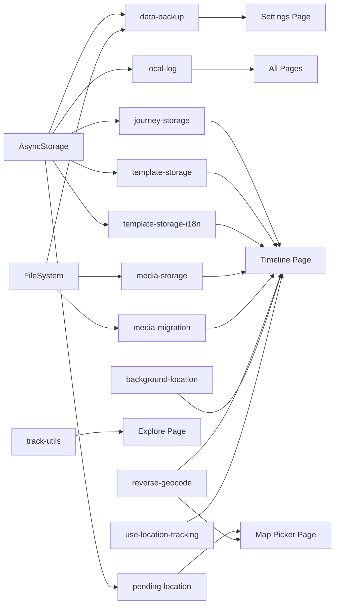

# Services

This document describes the core service modules in GoWherer. Source code is located in the `lib/` directory. All services are pure local computation or network requests with no backend API dependency.

---

## Storage Services

### Journey Storage (`lib/journey-storage.ts`)

Handles persistence of `Journey` arrays to AsyncStorage.

#### `loadJourneys()`

```typescript
async function loadJourneys(): Promise<Journey[]>
```

Loads all journey data from AsyncStorage. Returns an empty array if storage is empty or parsing fails. Automatically normalizes tags (deduplication, whitespace trimming) and media items (filters invalid entries) during load.

**Storage Key**: `gowherer:journeys:v1`

#### `saveJourneys(journeys)`

```typescript
async function saveJourneys(journeys: Journey[]): Promise<void>
```

Serializes and writes all journey data to AsyncStorage.

---

### Template Storage (`lib/template-storage.ts`)

Manages the configuration of journey entry templates.

#### `getDefaultEntryTemplateConfig()`

```typescript
function getDefaultEntryTemplateConfig(): EntryTemplateConfig
```

Returns the default template configuration, containing separate template sets for Travel and Commute modes, each with 4 built-in templates: Departure, Arrival, Rest, Checkpoint.

#### `loadEntryTemplateConfig()`

```typescript
async function loadEntryTemplateConfig(): Promise<EntryTemplateConfig>
```

Loads template configuration from AsyncStorage. Returns default configuration if storage is empty or parsing fails.

**Storage Key**: `gowherer:entry-templates:v1`

#### `saveEntryTemplateConfig(config)`

```typescript
async function saveEntryTemplateConfig(config: EntryTemplateConfig): Promise<void>
```

Serializes and writes template configuration to AsyncStorage.

---

### Template i18n Storage (`lib/template-storage-i18n.ts`)

Supports storing template configurations separately by locale.

#### `getDefaultEntryTemplateConfig(locale)`

```typescript
function getDefaultEntryTemplateConfig(locale: Locale): EntryTemplateConfig
```

Returns the default template configuration for the specified locale.

#### `loadEntryTemplateConfig(locale)`

```typescript
async function loadEntryTemplateConfig(locale: Locale): Promise<EntryTemplateConfig>
```

Loads template configuration from the locale-specific storage key.

**Storage Keys**: `gowherer:entry-templates:v1:zh` (Chinese), `gowherer:entry-templates:v1:en` (English)

#### `saveEntryTemplateConfig(locale, config)`

```typescript
async function saveEntryTemplateConfig(locale: Locale, config: EntryTemplateConfig): Promise<void>
```

Writes template configuration to the locale-specific storage key.

---

### Pending Location (`lib/pending-location.ts`)

Temporarily stores a user-selected location during the map picker flow, for later consumption.

#### `setPendingLocation(location)`

```typescript
async function setPendingLocation(location: TimelineLocation): Promise<void>
```

Stores the selected location to AsyncStorage.

**Storage Key**: `gowherer:pending-location:v1`

#### `consumePendingLocation()`

```typescript
async function consumePendingLocation(): Promise<TimelineLocation | null>
```

Reads and deletes the pending location. Returns the location data; returns `null` if none exists or parsing fails.

---

## Track Services (`lib/track-utils.ts`)

Provides GPS track point processing and statistics capabilities.

#### `sanitizeTrackLocations(locations)`

```typescript
function sanitizeTrackLocations(
  locations: Array<TimelineLocation | null | undefined>
): TimelineLocation[]
```

Filters and normalizes the track point list, removing invalid coordinates (out-of-range latitude/longitude or non-numeric values).

#### `haversineKm(a, b)`

```typescript
function haversineKm(a: TimelineLocation, b: TimelineLocation): number
```

Calculates the great-circle distance between two points using the Haversine formula (result in kilometers).

#### `smoothTrackLocations(locations)`

```typescript
function smoothTrackLocations(locations: TimelineLocation[]): TimelineLocation[]
```

Applies weighted smoothing to track points (25% weight for adjacent points, 50% for the center point). First and last points remain unchanged. Returns the original list if fewer than 3 points.

#### `calculateTrackDistanceKm(locations)`

```typescript
function calculateTrackDistanceKm(locations: TimelineLocation[]): number
```

Calculates total track distance (in kilometers). Sequentially applies the Haversine formula to accumulate distances between adjacent points.

---

## Geocoding (`lib/reverse-geocode.ts`)

Provides place name resolution and coordinate system conversion.

### Coordinate Conversion

#### `toGcj02(latitude, longitude)`

```typescript
function toGcj02(latitude: number, longitude: number): { latitude: number; longitude: number }
```

Converts WGS84 coordinates to GCJ02 (China Geodetic Coordinate System 2000) for use with Amap. Returns original values if coordinates are outside China.

#### `toWgs84(latitude, longitude)`

```typescript
function toWgs84(latitude: number, longitude: number): { latitude: number; longitude: number }
```

Converts GCJ02 coordinates back to WGS84. Returns original values if coordinates are outside China.

### Place Name Resolution

#### `reverseGeocodePlaceName(latitude, longitude, options?)`

```typescript
async function reverseGeocodePlaceName(
  latitude: number,
  longitude: number,
  options?: { coordinateType?: CoordinateType }
): Promise<string | undefined>
```

Converts coordinates to a human-readable place name. Prioritizes Amap Web API (requires `EXPO_PUBLIC_AMAP_WEB_KEY` configured). Falls back to system native geocoding if Amap call fails or the key is not configured.

| Parameter | Type | Description |
|-----------|------|-------------|
| `latitude` | `number` | Latitude |
| `longitude` | `number` | Longitude |
| `options.coordinateType` | `CoordinateType` | Input coordinate type, defaults to `wgs84` |

Returns the place name string; returns `undefined` if both methods fail.

### Nearby Places Query

#### `queryNearbyPlaces(latitude, longitude, radius?, options?)`

```typescript
async function queryNearbyPlaces(
  latitude: number,
  longitude: number,
  radius?: number,
  options?: { coordinateType?: CoordinateType }
): Promise<NearbyPlace[]>
```

Queries the list of POIs around the specified coordinates (via Amap Web API). Only works when the Amap key is properly configured; otherwise returns an empty array.

| Parameter | Type | Default | Description |
|-----------|------|---------|-------------|
| `latitude` | `number` | — | Latitude |
| `longitude` | `number` | — | Longitude |
| `radius` | `number` | `1200` | Query radius (meters), range 200-5000 |
| `options.coordinateType` | `CoordinateType` | `wgs84` | Input coordinate type |

---

## Local Logging (`lib/local-log.ts`)

In-app logging system that writes logs to a local file for error tracking and debugging.

#### `logLocalInfo(tag, message, data?)`

```typescript
async function logLocalInfo(tag: string, message: string, data?: unknown): Promise<void>
```

Logs an info-level entry. Format: `[ISO timestamp] [INFO] [tag] message | data`

#### `logLocalError(tag, error, data?)`

```typescript
async function logLocalError(tag: string, error: unknown, data?: unknown): Promise<void>
```

Logs an error-level entry. Error objects are serialized to `{ message, stack }` format.

#### `getLocalLogFileUri()`

```typescript
function getLocalLogFileUri(): string
```

Returns the log file path URI for sharing/exporting.

#### `initLocalLogFile()`

```typescript
async function initLocalLogFile(): Promise<void>
```

Initializes the log file and writes an initialization record.

**Log File Path**: `${FileSystem.documentDirectory}gowherer-debug.log`

---

## Data Backup (`lib/data-backup.ts`)

Provides application data export and import for cross-device migration.

### `buildAppBackup(appVersion)`

```typescript
async function buildAppBackup(appVersion: string): Promise<AppBackupV1>
```

Builds a complete backup containing journeys, templates, theme, and locale preferences.

**Returns**: `AppBackupV1` object

### `writeBackupToFile(backup)`

```typescript
async function writeBackupToFile(backup: AppBackupV1): Promise<{ fileName: string; uri: string }>
```

Writes backup data to a JSON file in the cache directory.

### `serializeBackup(backup)`

```typescript
function serializeBackup(backup: AppBackupV1): string
```

Serializes backup to JSON string for sharing or copying.

### `parseBackupString(raw)`

```typescript
function parseBackupString(raw: string): AppBackupV1
```

Parses backup JSON string with version validation and format tolerance.

### `importBackup(backup)`

```typescript
async function importBackup(backup: AppBackupV1): Promise<ImportResult>
```

Writes backup data to AsyncStorage to complete data restoration.

---

## Media Storage (`lib/media-storage.ts`)

Manages persistent storage of media files (photos, videos, audio).

### `persistTimelineMedia(mediaItems)`

```typescript
async function persistTimelineMedia(mediaItems: TimelineMedia[]): Promise<TimelineMedia[]>
```

Copies media files to the app-managed directory `gowherer-media/`, returning media list with updated URIs. Already managed files are skipped.

**Media Directory**: `${FileSystem.documentDirectory}gowherer-media/`

---

## Media Migration (`lib/media-migration.ts`)

Migrates media files from the old cache directory to the app-managed directory, fixing broken media references after app upgrades.

### `getMediaMigrationStats()`

```typescript
async function getMediaMigrationStats(): Promise<{ hasOldMedia: boolean; oldFileCount: number }>
```

Checks if the old cache directory (`cacheDirectory/ImagePicker/`) has leftover media files.

### `migrateOldMedia(journeys)`

```typescript
async function migrateOldMedia(journeys: Journey[]): Promise<{ migrated: number; failed: number }>
```

Moves media files from the old cache directory to `gowherer-media/` and updates all URI references in Journey data.

---

## Background Location (`lib/background-location.ts`)

Background GPS tracking based on `expo-gaode-map` and `expo-task-manager`.

### `startLocationTracking(journeyId)`

```typescript
async function startLocationTracking(journeyId: string): Promise<void>
```

Starts background location tracking, buffering track points to AsyncStorage and periodically batch-appending to the Journey's `trackLocations`.

### `stopLocationTracking()`

```typescript
async function stopLocationTracking(): Promise<void>
```

Stops background location tracking.

### `isLocationTrackingActive()`

```typescript
async function isLocationTrackingActive(): Promise<boolean>
```

Checks if a tracking session is currently active.

### `syncBufferedTrackLocations()`

```typescript
async function syncBufferedTrackLocations(): Promise<void>
```

Flushes buffered track points to Journey data.

---

## Location Tracking Hook (`hooks/use-location-tracking.ts`)

React Hook wrapping background location tracking for use in page components.

### `useLocationTracking(activeJourney, onRefreshJourneys?)`

```typescript
function useLocationTracking(
  activeJourney: Journey | undefined,
  onRefreshJourneys?: () => void
): { locationTracking: boolean; trackingBusy: boolean; toggleTracking: () => void }
```

Automatically manages background location start/stop based on current journey state, returning tracking status and toggle method.

---

## Service Dependency Graph


```mermaid
flowchart LR
    Storage[AsyncStorage] --> JourneyStorage[journey-storage]
    Storage --> TemplateStorage[template-storage]
    Storage --> TemplateI18n[template-storage-i18n]
    Storage --> PendingLocation[pending-location]
    Storage --> LocalLog[local-log]
    Storage --> DataBackup[data-backup]

    FileSystem[FileSystem] --> MediaStorage[media-storage]
    FileSystem --> MediaMigration[media-migration]
    FileSystem --> DataBackup

    JourneyStorage --> JourneyPage[Timeline Page]
    TemplateStorage --> JourneyPage
    TemplateI18n --> JourneyPage
    PendingLocation --> LocationPicker[Map Picker Page]
    DataBackup --> SettingsPage[Settings Page]

    TrackUtils[track-utils] --> ExplorePage[Explore Page]
    MediaStorage --> JourneyPage
    MediaMigration --> JourneyPage
    ReverseGeocode[reverse-geocode] --> LocationPicker
    ReverseGeocode --> JourneyPage
    BackgroundLocation[background-location] --> JourneyPage
    LocationTracking[use-location-tracking] --> JourneyPage
    LocalLog --> AllPages[All Pages]
```