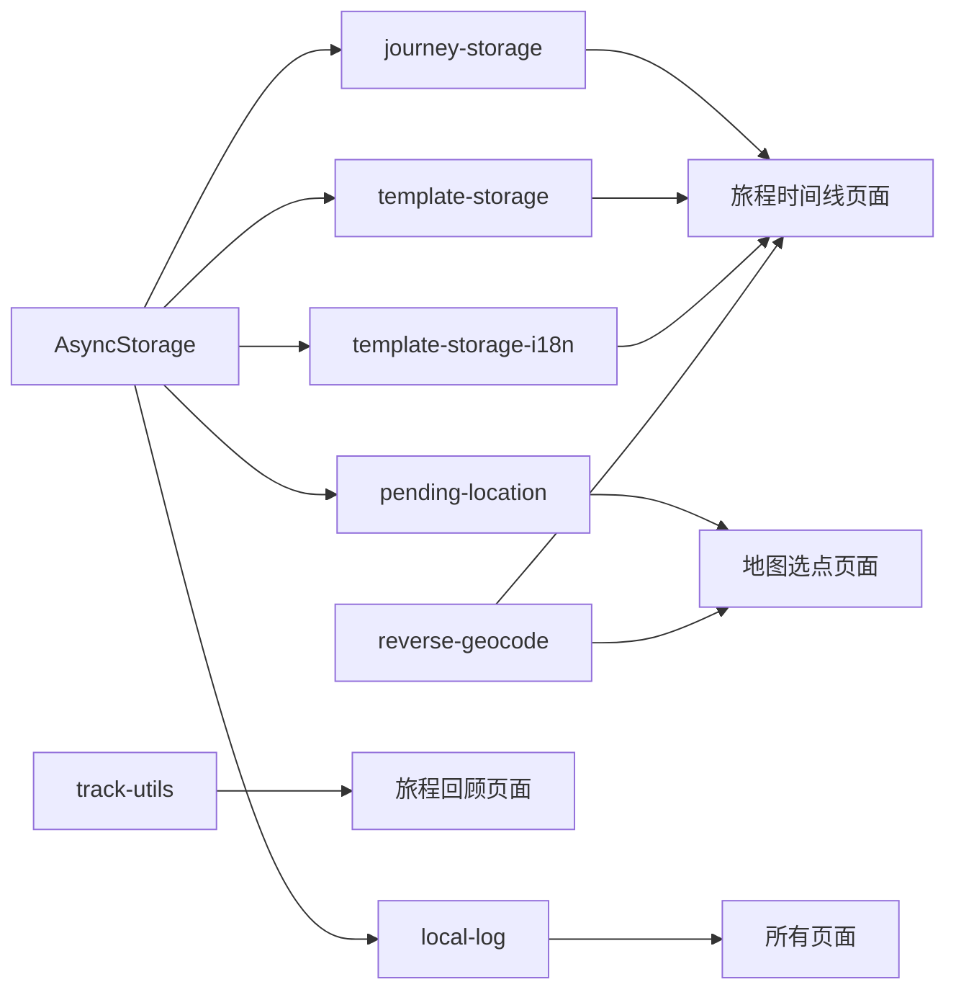

# 服务接口

本文档描述 GoWherer 应用的核心服务模块，源码位于 `lib/` 目录。所有服务均为纯本地计算或网络请求，不依赖后端 API。

---

## 存储服务

### 旅程存储 (`lib/journey-storage.ts`)

负责将 `Journey` 数组持久化到 AsyncStorage。

#### `loadJourneys()`

```typescript
async function loadJourneys(): Promise<Journey[]>
```

从 AsyncStorage 加载所有旅程数据。若存储为空或解析失败，返回空数组。加载时自动规范化标签（去重、去空白）和媒体项（过滤无效项）。

**存储键**：`gowherer:journeys:v1`

#### `saveJourneys(journeys)`

```typescript
async function saveJourneys(journeys: Journey[]): Promise<void>
```

将所有旅程数据序列化后写入 AsyncStorage。

---

### 模板存储 (`lib/template-storage.ts`)

管理旅程记录模板的配置。

#### `getDefaultEntryTemplateConfig()`

```typescript
function getDefaultEntryTemplateConfig(): EntryTemplateConfig
```

返回默认模板配置，包含旅行（travel）和通勤（commute）两套模板，每套 4 个预设模板：出发、到达、休息、打卡。

#### `loadEntryTemplateConfig()`

```typescript
async function loadEntryTemplateConfig(): Promise<EntryTemplateConfig>
```

从 AsyncStorage 加载模板配置。若存储为空或解析失败，返回默认配置。

**存储键**：`gowherer:entry-templates:v1`

#### `saveEntryTemplateConfig(config)`

```typescript
async function saveEntryTemplateConfig(config: EntryTemplateConfig): Promise<void>
```

将模板配置序列化后写入 AsyncStorage。

---

### 模板国际化存储 (`lib/template-storage-i18n.ts`)

支持按语言环境分别存储模板配置。

#### `getDefaultEntryTemplateConfig(locale)`

```typescript
function getDefaultEntryTemplateConfig(locale: Locale): EntryTemplateConfig
```

返回指定语言的默认模板配置。

#### `loadEntryTemplateConfig(locale)`

```typescript
async function loadEntryTemplateConfig(locale: Locale): Promise<EntryTemplateConfig>
```

从对应语言键加载模板配置。

**存储键**：`gowherer:entry-templates:v1:zh`（中文）、`gowherer:entry-templates:v1:en`（英文）

#### `saveEntryTemplateConfig(locale, config)`

```typescript
async function saveEntryTemplateConfig(locale: Locale, config: EntryTemplateConfig): Promise<void>
```

将模板配置写入对应语言的存储键。

---

### 待处理位置 (`lib/pending-location.ts`)

在地图选点场景中，临时存储用户选择的位置，供后续流程消费。

#### `setPendingLocation(location)`

```typescript
async function setPendingLocation(location: TimelineLocation): Promise<void>
```

将选中的位置存入 AsyncStorage。

**存储键**：`gowherer:pending-location:v1`

#### `consumePendingLocation()`

```typescript
async function consumePendingLocation(): Promise<TimelineLocation | null>
```

读取并删除待处理位置。返回位置数据；若不存在或解析失败，返回 `null`。

---

## 轨迹服务 (`lib/track-utils.ts`)

提供 GPS 轨迹点的处理与统计能力。

#### `sanitizeTrackLocations(locations)`

```typescript
function sanitizeTrackLocations(
  locations: Array<TimelineLocation | null | undefined>
): TimelineLocation[]
```

过滤并规范化轨迹点列表，移除无效坐标（纬度/经度越界或非数字）。

#### `haversineKm(a, b)`

```typescript
function haversineKm(a: TimelineLocation, b: TimelineLocation): number
```

使用 Haversine 公式计算两点间的大圆距离（单位：公里）。

#### `smoothTrackLocations(locations)`

```typescript
function smoothTrackLocations(locations: TimelineLocation[]): TimelineLocation[]
```

对轨迹点进行加权平滑处理（前后点各取 25% 权重，中间点取 50%），首尾点保持不变。点数少于 3 个时直接返回原列表。

#### `calculateTrackDistanceKm(locations)`

```typescript
function calculateTrackDistanceKm(locations: TimelineLocation[]): number
```

计算轨迹总长度（公里）。依次调用 Haversine 公式累加相邻点间距离。

---

## 地理编码 (`lib/reverse-geocode.ts`)

提供位置名称解析与坐标系转换功能。

### 坐标系转换

#### `toGcj02(latitude, longitude)`

```typescript
function toGcj02(latitude: number, longitude: number): { latitude: number; longitude: number }
```

将 WGS84 坐标转换为 GCJ02（中国国测局）坐标，用于高德地图。若坐标在中国境外，则直接返回原值。

#### `toWgs84(latitude, longitude)`

```typescript
function toWgs84(latitude: number, longitude: number): { latitude: number; longitude: number }
```

将 GCJ02 坐标转换回 WGS84 坐标。若坐标在中国境外，则直接返回原值。

### 位置名称解析

#### `reverseGeocodePlaceName(latitude, longitude, options?)`

```typescript
async function reverseGeocodePlaceName(
  latitude: number,
  longitude: number,
  options?: { coordinateType?: CoordinateType }
): Promise<string | undefined>
```

将经纬度转换为可读地点名称。优先使用高德 Web API（需配置 `EXPO_PUBLIC_AMAP_WEB_KEY`），若调用失败或未配置 Key，则回退到系统原生地理编码。

| 参数 | 类型 | 说明 |
|------|------|------|
| `latitude` | `number` | 纬度 |
| `longitude` | `number` | 经度 |
| `options.coordinateType` | `CoordinateType` | 输入坐标类型，默认为 `wgs84` |

返回地点名称字符串；若均失败则返回 `undefined`。

### 附近地点查询

#### `queryNearbyPlaces(latitude, longitude, radius?, options?)`

```typescript
async function queryNearbyPlaces(
  latitude: number,
  longitude: number,
  radius?: number,
  options?: { coordinateType?: CoordinateType }
): Promise<NearbyPlace[]>
```

查询指定坐标周围的 POI 列表（通过高德地图 Web API）。仅在高德 Key 配置正确时有效，否则返回空数组。

| 参数 | 类型 | 默认值 | 说明 |
|------|------|--------|------|
| `latitude` | `number` | — | 纬度 |
| `longitude` | `number` | — | 经度 |
| `radius` | `number` | `1200` | 查询半径（米），范围 200-5000 |
| `options.coordinateType` | `CoordinateType` | `wgs84` | 输入坐标类型 |

---

## 本地日志 (`lib/local-log.ts`)

应用内日志系统，将日志写入本地文件，便于错误追踪与问题排查。

#### `logLocalInfo(tag, message, data?)`

```typescript
async function logLocalInfo(tag: string, message: string, data?: unknown): Promise<void>
```

记录信息级别日志。格式：`[ISO时间戳] [INFO] [tag] message | data`

#### `logLocalError(tag, error, data?)`

```typescript
async function logLocalError(tag: string, error: unknown, data?: unknown): Promise<void>
```

记录错误级别日志。Error 对象会被序列化为 `{ message, stack }` 格式。

#### `getLocalLogFileUri()`

```typescript
function getLocalLogFileUri(): string
```

获取日志文件路径 URI，供分享/导出使用。

#### `initLocalLogFile()`

```typescript
async function initLocalLogFile(): Promise<void>
```

初始化日志文件，写入初始化记录。

**日志文件路径**：`${FileSystem.documentDirectory}gowherer-debug.log`

---

## 服务依赖关系

