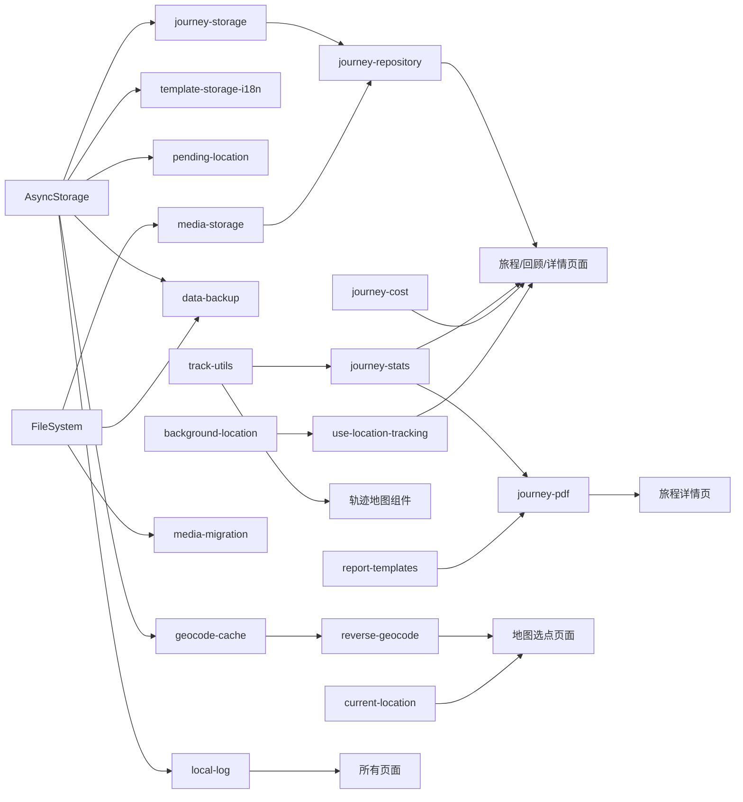

# 服务接口

本文档描述 GoWherer 应用的核心服务模块，源码位于 `lib/` 目录。所有服务均为纯本地计算或网络请求，不依赖后端 API。

---

## 存储服务

### 旅程存储 (`lib/journey-storage.ts`)

负责将 `Journey` 数组持久化到 AsyncStorage。

#### `loadJourneys()`

```typescript
async function loadJourneys(): Promise<Journey[]>
```

从 AsyncStorage 加载所有旅程数据。若存储为空或解析失败，返回空数组。加载时自动规范化标签（去重、去空白）、媒体项（过滤无效项）与 `trackLocations`（缺失时补空数组）。

**存储键**：`gowherer:journeys:v1`

#### `saveJourneys(journeys)`

```typescript
async function saveJourneys(journeys: Journey[]): Promise<void>
```

将所有旅程数据序列化后写入 AsyncStorage。

---

### 旅程仓库 (`lib/journey-repository.ts`)

旅程数据的统一写入入口，内部以写入队列串行化所有变更，避免并发读写丢数据；每次变更后自动对比前后差异，级联删除不再被引用的媒体文件。

#### `createJourney(title, kind, tags)`

创建一条进行中的旅程。

#### `markJourneyCompleted(journeyId)`

结束旅程（`active` → `completed`，写入 `endedAt`）。

#### `insertJourneyEntry(journeyId, entry)` / `replaceJourneyEntry(journeyId, entry)` / `deleteJourneyEntry(journeyId, entryId)`

新增、更新、删除时间线条目；删除条目时同步清理其媒体文件。

#### `appendJourneyTrackLocations(journeyId, locations)`

将后台追踪缓冲的轨迹点批量追加到指定旅程。

#### `deleteJourney(journeyId)` / `overwriteJourneys(journeys)`

删除整条旅程（级联清理媒体），或整体覆盖旅程列表（供备份恢复使用）。

---

### 模板存储 (`lib/template-storage.ts` / `lib/template-storage-i18n.ts`)

管理旅程记录模板的配置，支持按语言环境分别存储。

#### `getDefaultEntryTemplateConfig(locale)`

返回指定语言的默认模板配置，包含旅行（travel）和通勤（commute）两套模板，每套 4 个预设模板：出发、到达、休息、打卡。

#### `loadEntryTemplateConfig(locale)` / `saveEntryTemplateConfig(locale, config)`

从/向对应语言键读写模板配置，解析失败时回退默认配置。

**存储键**：`gowherer:entry-templates:v1:zh`（中文）、`gowherer:entry-templates:v1:en`（英文）

---

### 待处理位置 (`lib/pending-location.ts`)

在地图选点场景中，临时存储用户选择的位置，供后续流程消费。

#### `setPendingLocation(location)` / `consumePendingLocation()`

写入与读取后即删的一次性位置交接。读取失败返回 `null`。

**存储键**：`gowherer:pending-location:v1`

---

## 统计服务 (`lib/journey-stats.ts`)

行程统计、分段统计与展示格式化的统一出口。

#### `computeJourneyStats(journey, trackLocations?)`

```typescript
function computeJourneyStats(
  journey: Journey,
  trackLocations?: TimelineLocation[]
): { locationPoints: number; distanceKm: number; durationMs: number; avgSpeedKmh: number }
```

计算旅程总里程（优先 GPS 轨迹，无轨迹时回退条目定位点）、总时长、平均速度与定位点数量。

#### `computeSegmentStats(journey, trackLocations, startIndex, endIndex)`

```typescript
function computeSegmentStats(
  journey: Journey,
  trackLocations: TimelineLocation[],
  startIndex: number,
  endIndex: number
): SegmentStats
```

计算两个记录点之间的分段统计：段耗时、段里程（取两点间 `capturedAt` 命中的 GPS 轨迹点求和，不足两点时回退两点直线距离）、段均速，以及用于地图高亮的分段轨迹 `segmentTrack`。

#### `getSegmentStats(journey, trackLocations, journeyId, startIndex, endIndex)`

带缓存（按 `journeyId:start:end` 键）的分段统计封装，避免下拉切换时重复计算数千个轨迹点。

#### 格式化工具

- `formatDateTime(iso?)`：`MM/dd HH:mm` 展示。
- `formatDuration(durationMs, t)`：本地化的时长文案。
- `formatLocationLabel(location)`：地点名 + 坐标。
- `kindLabel(kind, t)`：旅程类型文案。
- `getJourneyTrackLocations(journey)` / `getJourneyEntryLocations(journey)` / `getJourneyTrackMapMarkerLocations(journey, trackLocations?)`：轨迹/标记点集合的清洗与合成。

---

## 交通费 (`lib/journey-cost.ts`)

#### `sumJourneyCosts(journey)`

```typescript
function sumJourneyCosts(journey: Journey): number
```

对旅程所有条目的 `cost.amount` 求和（以"分"为单位取整后再换算，避免浮点误差），返回交通费总额（元）。

#### `formatCostAmount(amount)`

金额展示：整数不带小数，非整数保留两位。

#### `JOURNEY_COST_MODES`

全部交通方式枚举：`metro`（地铁）、`rail`（高铁）、`bus`（公交）、`taxi`（打车）、`flight`（航班）、`other`（其他）。

---

## 导出服务

### PDF 导出 (`lib/journey-pdf.ts`)

#### `exportJourneyPdf(journey, t, templateId?)`

```typescript
async function exportJourneyPdf(
  journey: Journey,
  t: TFunction,
  templateId: ReportTemplateId
): Promise<void>
```

按所选模板生成旅程报告并导出 PDF：构建 HTML（含轨迹图、统计、时间线明细与交通费明细表）→ `expo-print` 渲染为文件 → 以旅程标题命名后调起系统分享。Web 端直接调用浏览器打印。

#### `buildTrackImage(...)`

基于轨迹点生成 SVG 并渲染为位图，嵌入 PDF 作为路线预览图；轨迹点过多时自动抽稀（`simplifyTrackLocations`）。

#### 媒体内嵌

导出前将照片缩放（最长边 1280px）并重编码为 JPEG（压缩率 0.7）后内嵌 base64，避免多媒体旅程产生超大文档；视频封面使用 `expo-video-thumbnails` 生成。

### 导出模板 (`lib/report-templates.ts`)

```typescript
export type ReportTemplateId = 'classic' | 'compact';
export const REPORT_TEMPLATES: ReportTemplateId[];
export const DEFAULT_REPORT_TEMPLATE: ReportTemplateId; // 'classic'
```

- `classic` 经典：青绿封面 · 时间线卡片 · 交通费表。
- `compact` 简约：单页紧凑排版 · 蓝色基调。

### 长图导出 (`app/journey-detail.tsx`)

详情页将报告视图离屏渲染后通过 `react-native-view-shot` 截图为长图，保存并分享，适合社交平台发布。

---

## 轨迹服务 (`lib/track-utils.ts`)

提供 GPS 轨迹点的处理与统计能力。

#### `sanitizeTrackLocations(locations)`

过滤并规范化轨迹点列表，移除无效坐标（纬度/经度越界或非数字）。

#### `haversineKm(a, b)`

使用 Haversine 公式计算两点间的大圆距离（单位：公里）。

#### `smoothTrackLocations(locations)`

对轨迹点进行加权平滑处理（前后点各取 25% 权重，中间点取 50%），首尾点保持不变。

#### `prepareTrackRouteLocations(locations)`

合成用于绘制路线的点序列（轨迹点与条目定位点按时间合并、去重）。

#### `simplifyTrackLocations(locations, maxPoints = 200)`

按距离抽稀轨迹点，用于地图渲染与导出图生成，控制点数上限。

#### `calculateTrackDistanceKm(locations)`

计算轨迹总长度（公里），依次累加相邻点间 Haversine 距离。

---

## 地理编码 (`lib/reverse-geocode.ts` + `lib/geocode-cache.ts`)

### 坐标系转换

#### `toGcj02(latitude, longitude)` / `toWgs84(latitude, longitude)`

WGS84 ↔ GCJ02 互转；中国境外坐标直接返回原值。

### 位置名称解析

#### `reverseGeocodePlaceName(latitude, longitude, options?)`

将经纬度转换为可读地点名称。优先使用高德 Web API（需配置 `EXPO_PUBLIC_AMAP_WEB_KEY`），若调用失败或未配置 Key，则回退到系统原生地理编码。

| 参数 | 类型 | 说明 |
|------|------|------|
| `latitude` | `number` | 纬度 |
| `longitude` | `number` | 经度 |
| `options.coordinateType` | `CoordinateType` | 输入坐标类型，默认为 `wgs84` |

### 逆地理编码缓存 (`lib/geocode-cache.ts`)

以约 110 米经纬度网格为键的本地缓存：

- 命中缓存不回源请求，未命中才发起解析。
- 内存 + AsyncStorage 双层存储，延迟批量落盘（2 秒）。
- 容量上限 500 条，超出时按最旧淘汰。
- 相同网格的并发请求自动去重，只发一次网络请求。

**存储键**：`gowherer:geocode-cache:v1`

### 附近地点查询

#### `queryNearbyPlaces(latitude, longitude, radius?, options?)`

查询指定坐标周围的 POI 列表（通过高德地图 Web API）。仅在高德 Key 配置正确时有效，否则返回空数组。

| 参数 | 类型 | 默认值 | 说明 |
|------|------|--------|------|
| `latitude` | `number` | — | 纬度 |
| `longitude` | `number` | — | 经度 |
| `radius` | `number` | `1200` | 查询半径（米），范围 200-5000 |
| `options.coordinateType` | `CoordinateType` | `wgs84` | 输入坐标类型 |

---

## 定位服务

### 当前位置 (`lib/current-location.ts`)

#### `getBestCurrentTimelineLocation(options?)`

多次尝试获取当前位置（默认超时 12 秒、目标精度 50 米、单次尝试 5 秒、间隔 800ms），返回精度最好的 `TimelineLocation`；自动推断坐标系统（高德 SDK 返回 GCJ02，`expo-location` 返回 WGS84）。

#### `requestForegroundLocationAccess()`

请求前台定位权限。

#### `toTimelineLocation(coordinates, options?)`

将 SDK 坐标转换为 `TimelineLocation`。

### 后台定位 (`lib/background-location.ts`)

基于 `expo-gaode-map` 和 `expo-task-manager` 实现后台 GPS 追踪。

#### `startLocationTracking(journeyId)` / `stopLocationTracking()`

启动/停止后台位置追踪，轨迹点缓冲写入 AsyncStorage，定期批量经 `journey-repository` 追加到对应旅程的 `trackLocations`。

#### `isLocationTrackingActive()` / `syncBufferedTrackLocations()`

检查追踪任务状态；手动冲刷缓冲区。

### 定位追踪 Hook (`hooks/use-location-tracking.ts`)

```typescript
function useLocationTracking(
  activeJourney: Journey | undefined,
  onRefreshJourneys?: () => void
): { locationTracking: boolean; trackingBusy: boolean; toggleTracking: () => void }
```

根据当前旅程状态自动管理后台定位的启停。

---

## 媒体存储 (`lib/media-storage.ts`)

管理媒体文件（照片、视频、音频）的持久化与治理。

**媒体目录**：`${FileSystem.documentDirectory}gowherer-media/`

#### `persistTimelineMedia(mediaItems)`

将媒体文件复制到应用托管目录，返回更新 URI 后的媒体列表。已托管的文件会被跳过。

#### `diffManagedMediaUris(before, after)`

对比两组旅程数据，找出不再被引用的托管媒体 URI。

#### `deleteMediaFiles(uris)`

删除指定媒体文件。

#### `scanMediaStorage(journeys)`

扫描托管目录，返回存储报告（文件数、占用空间、孤儿文件列表）。

#### `deleteOrphanMediaFiles(journeys)`

删除不再被任何旅程引用的孤儿媒体文件（设置页"媒体存储清理"入口）。

### 媒体迁移 (`lib/media-migration.ts`)

将旧版缓存目录中的媒体文件迁移到应用托管目录，解决升级后媒体引用失效问题。

#### `getMediaMigrationStats()`

检查旧缓存目录是否有残留媒体文件。

#### `migrateOldMedia(journeys)`

移动旧媒体文件并更新所有 Journey 中对应的 URI 引用。

---

## 数据备份 (`lib/data-backup.ts`)

提供应用数据的导出与导入功能，支持跨设备迁移。

#### `buildAppBackup(appVersion)` / `writeBackupToFile(backup)` / `serializeBackup(backup)`

构建完整备份（旅程、模板、主题与语言偏好）、写入 JSON 文件、序列化为字符串。

#### `parseBackupString(raw)` / `importBackup(backup)`

解析备份字符串（版本校验与格式容错），写入 AsyncStorage 完成恢复。

---

## 开源许可 (`lib/license-catalog.ts`)

静态许可目录，数据来自 `assets/licenses.json`（由 `scripts/generate-licenses.js` 基于 `license-checker` 从完整生产依赖树生成）。

提供依赖列表的加载与检索能力，供许可页展示：直接依赖置顶，支持按许可类型筛选与按名称/版本搜索。

---

## 高德隐私合规 (`lib/amap-privacy.ts`)

#### `ensureAmapPrivacyReady()`

在使用高德 SDK 前完成隐私合规初始化（含合规版本号），Web 端跳过，重复调用幂等。

---

## 本地日志 (`lib/local-log.ts`)

应用内日志系统，将日志写入本地文件，便于错误追踪与问题排查。

#### `logLocalInfo(tag, message, data?)` / `logLocalError(tag, error, data?)`

记录信息/错误级别日志，Error 对象序列化为 `{ message, stack }`。

#### `getLocalLogFileUri()` / `initLocalLogFile()`

获取日志文件 URI（供分享/导出）；初始化日志文件。

**日志文件路径**：`${FileSystem.documentDirectory}gowherer-debug.log`

---

## 服务依赖关系


```mermaid
flowchart LR
    Storage[AsyncStorage] --> JourneyStorage[journey-storage]
    Storage --> TemplateI18n[template-storage-i18n]
    Storage --> PendingLocation[pending-location]
    Storage --> LocalLog[local-log]
    Storage --> DataBackup[data-backup]
    Storage --> GeocodeCache[geocode-cache]

    FileSystem[FileSystem] --> MediaStorage[media-storage]
    FileSystem --> MediaMigration[media-migration]
    FileSystem --> DataBackup

    JourneyStorage --> JourneyRepo[journey-repository]
    MediaStorage --> JourneyRepo
    JourneyRepo --> JourneyPages[旅程/回顾/详情页面]

    JourneyStats[journey-stats] --> JourneyPages
    JourneyStats --> JourneyPdf[journey-pdf]
    JourneyCost[journey-cost] --> JourneyPages
    ReportTemplates[report-templates] --> JourneyPdf
    JourneyPdf --> DetailPage[旅程详情页]

    TrackUtils[track-utils] --> JourneyStats
    TrackUtils --> TrackMap[轨迹地图组件]
    GeocodeCache --> ReverseGeocode[reverse-geocode]
    ReverseGeocode --> LocationPicker[地图选点页面]
    CurrentLocation[current-location] --> LocationPicker
    BackgroundLocation[background-location] --> TrackingHook[use-location-tracking]
    TrackingHook --> JourneyPages
    LocalLog --> AllPages[所有页面]
```
